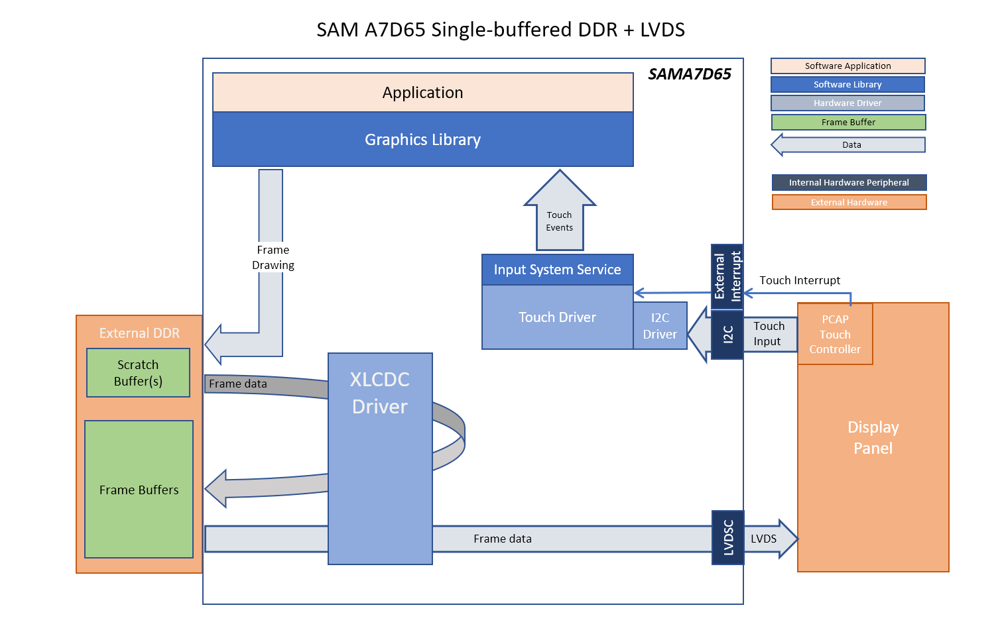

blank_qs_a7d65_cu_ac69t88a.X

Defining the Architecture
-------------------------

This application tests the display.

User touch input on the display panel is received through the PCAP capacitive touch controller, which sends a notification to the Touch Input Driver. The Touch Input Driver reads the touch information over I2C and sends the touch event to the Input System Service. Points at the corners of the display can be used to test touch functionality.

### Demonstration Features

-   Test application for the A7D65 Curiosity Evaluation Board
-   Test pattern that validates display and touch functionality
-   24-bit color, multi-layer, WVGA (800x480)
-   Time system service, TC0 peripheral library and driver
-   Graphics Acceleration using integrated display controller (XLCDC)
-   I2C and maXTouch® controller driver

Creating the Project Graph
--------------------------

The Project Graph diagram shows the Harmony 3 components that are included in this application. Lines between components are drawn to satisfy components that depend on a capability that another component provides. In this case, the Legato graphics library is disconnected and removed to test the display driver without any library.

Building the Application
------------------------

The parent directory for this application is gfx/apps/blank\_quickstart. To build this application, use MPLAB X IDE to open the gfx/apps/blank\_quickstart/blank\_qs\_a7d65\_cu\_ac69t88a.X project folder and press F11.
A successful build will generate a harmony.bin file in dist/curiosity_ac69t88a/production in the project folder.

The following table lists configuration properties:

| Project Name                    | BSP Used                                                                                        | Graphics Template Used                        | Description                                                                                                                                                                                                |
| :------------------------------ | :---------------------------------------------------------------------------------------------- | :-------------------------------------------- | :--------------------------------------------------------------------------------------------------------------------------------------------------------------------------------------------------------- |
| blank\_qs\_a7d65\_cu\_ac69t88a.X | [SAM A7D65 Curiosity BSP](https://www.microchip.com/en-us/development-tool/ea89c15a) | Legato Graphics w/ Microchip AC69T88A Display | [SAM A7D65 Curiosity](https://www.microchip.com/en-us/development-tool/ea89c15a)  with MIPI Interface and [AC69T88A LVDS WVGA Display](https://www.microchip.com/en-us/development-tool/AC69T88A?allDevTools=true) |

Configuring the Hardware
------------------------

Configure the hardware as follows:
-   Connect the [AC69T88A LVDS WVGA Display](https://www.microchip.com/en-us/development-tool/AC69T88A?allDevTools=true) to the SAM A7D65 Curiosity Board using the included FFC ribbon.

-	Take an SD Card formatted with the FAT32 file system and copy the boot.bin binary file from this [location](./binaries/boot.bin). Also copy the harmony.bin file you generated from the "Building the Application" section.

-   Insert the SD card into the SD card slot and power up the board by connecting a USB-C cable to the USB port.

Running the Demonstration
-------------------------
The LCD should display a test pattern on successful power-on. Click the points at the corners to test touch functionality.

**NOTE**: Image for reference only, actual layout will depepend on display resolution and orientation.

* * * * *
