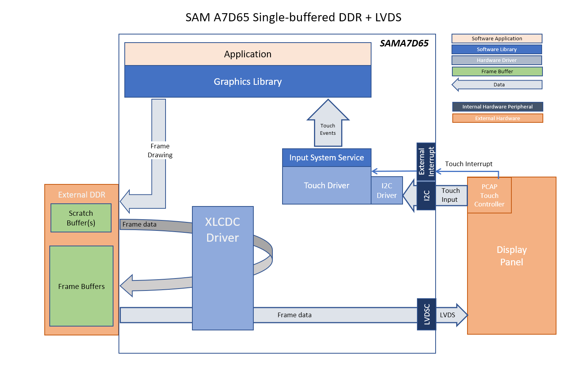
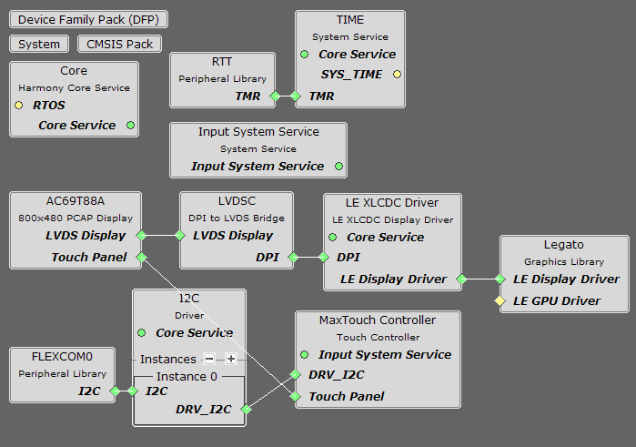
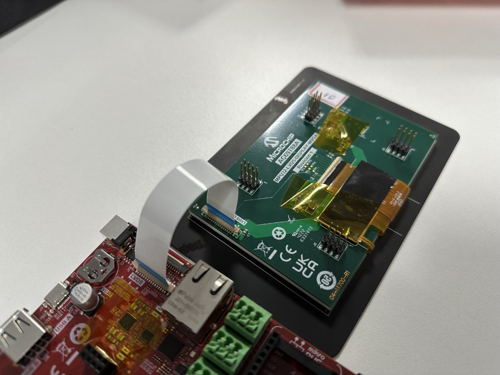
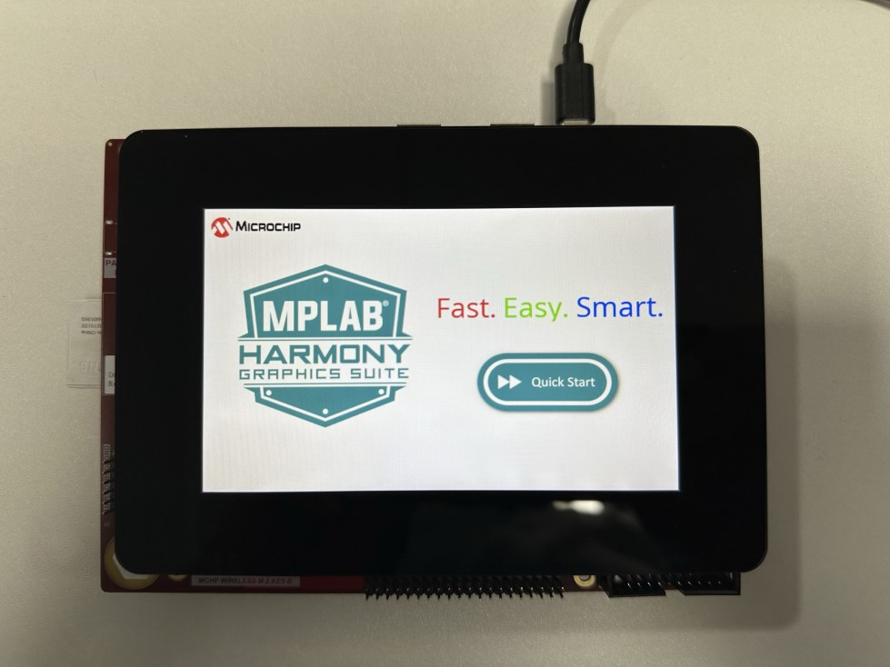

legato_qs_a7d65_curiosity_ac69t88a.X

Defining the Architecture
-------------------------

This application demonstrates multi-layer WVGA graphics using DDR memory.

User touch input on the display panel is received through the PCAP capacitive touch controller, which sends a notification to the Touch Input Driver. The Touch Input Driver reads the touch information over I2C and sends the touch event to the Graphics Library through the Input System Service.

### Demonstration Features

-   Legato Graphics Library
-   Reference application for the SAMA7D65 Curiosity
-   24-bit color, multi-layer, WVGA (800x480) screen design
-   Time system service, RTT peripheral library and driver
-   Graphics Acceleration using integrated display controller (XLCDC)
-   I2C and maXTouch® controller driver

Creating the Project Graph
--------------------------

The Project Graph diagram shows the Harmony 3 components that are included in this application. Lines between components are drawn to satisfy components that depend on a capability that another component provides.

Building the Application
------------------------

The parent directory for this application is gfx/apps/legato\_quickstart. To build this application, use MPLAB X IDE to open the gfx/apps/legato\_quickstart/firmware/legato\_qs\_a7d65\_curiosity\_ac69t88a.X project folder and press F11.
A successful build will generate a harmony.bin file in dist/le\_qs\_a7d65\_curiosity\_ac69t88a/production in the project folder.

The following table lists configuration properties:

|Project Name|BSP Used|Graphics Template Used|Description|
|:-----------|:-------|:---------------------|:----------|
|legato\_qs\_a7d65\_curiosity\_ac69t88a.X|NA|NA|[SAMA7D65 Curiosity](https://www.microchipdirect.com/dev-tools/EV40F82A?allDevTools=true) using XLCDC internal graphics controller to drive the [AC69T88A LVDS WVGA Display](https://www.microchipdirect.com/dev-tools/AC69T88A?allDevTools=true) |

> **NOTE:** This application may contain custom code that is marked by the comments // START OF CUSTOM CODE ... and // END OF CUSTOM CODE. When using the MPLAB Code Configurator to regenerate the application code, do not remove or replace the custom code.

Configuring the Hardware
------------------------

Configure the hardware as follows:
-   Connect the AC69T88A display to the SAMA7D65 Curiosity using a 30-pin 0.5mm pitch Type D (contacts on opposite sides) FFC ribbon.

-	Take an SD Card formatted with the FAT32 file system and copy the boot.bin binary file from this [location](./binaries/boot.bin). Also copy the harmony.bin file you generated from the "Building the Application" section.

-   Insert the SD card into the SD CARD slot on the SAMA7D65 Curiosity and power up the board by connecting a USB-C cable to the USB port or an adapter to the barrel jack (5V/1A recommended, Center Positive).

Running the Demonstration
-------------------------
The LCD should display a simple menu with images, text, and a button on successful power-on. See reference image.

* * * * *
