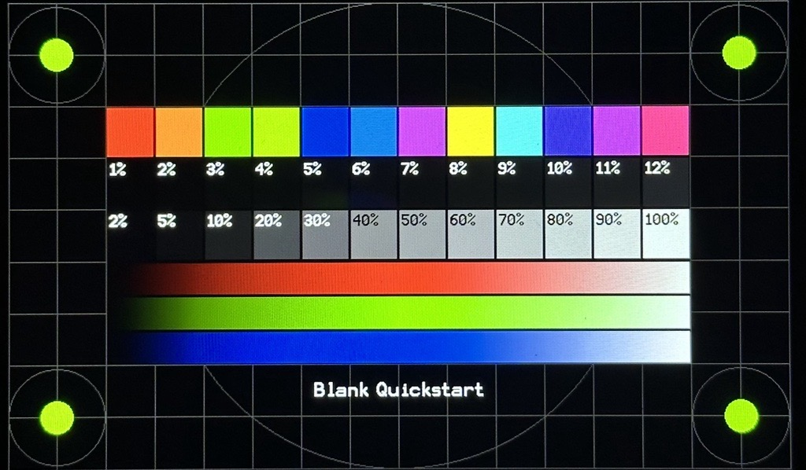

# Example Applications

**NOTE:** The blank examples published in this repository are intended for engineering display bring-up only.

For feature-rich, professional Microchip Graphics Suite demonstrations and demonstrations from third-party graphics libaries, refer to user guides on [Microchip Developer Help](https://developerhelp.microchip.com/xwiki/bin/view/software-tools/mgs/dev-kits/) or browse on [MPLAB® Discover](https://mplab-discover.microchip.com/v2?dsl=Microchip+AND+Graphics+AND+Suite+AND+A7D).

## Blank Examples

* [Blank Quickstart](./blank_quickstart/readme.md)

This demonstration provides a touch-enabled test pattern to validate the graphics subsystem.

