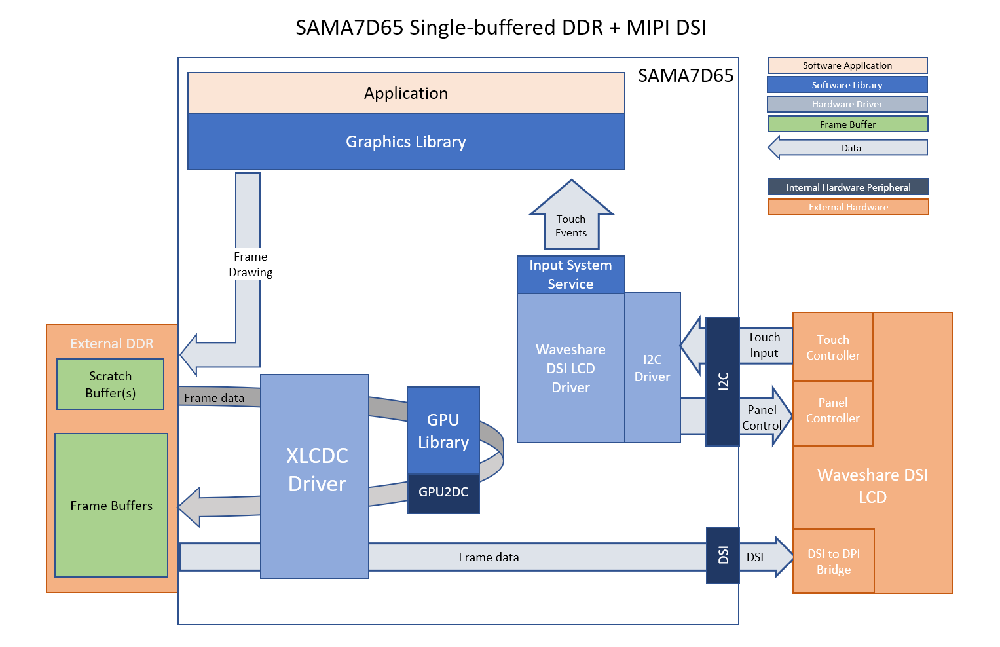
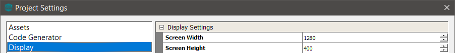
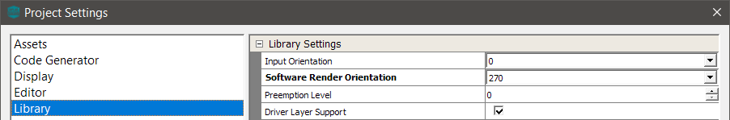
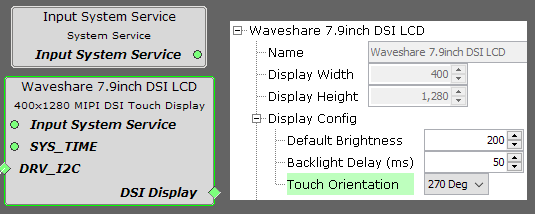
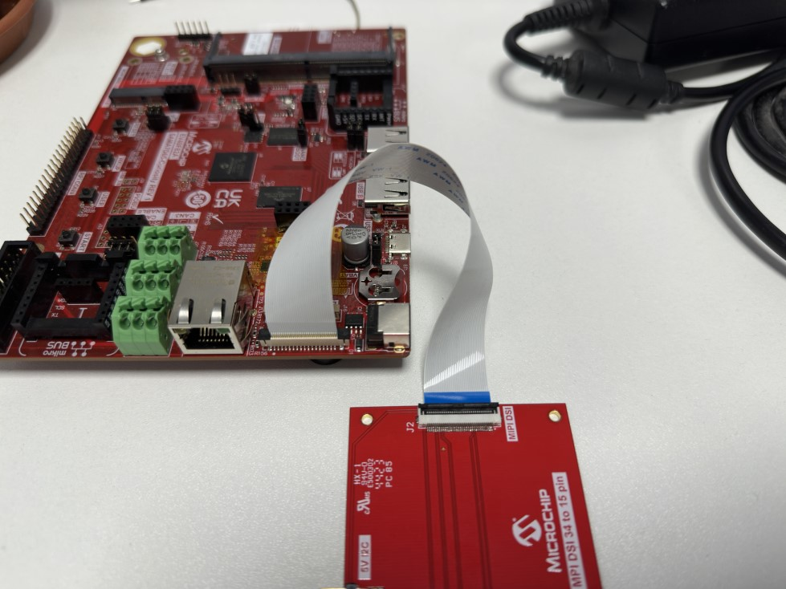
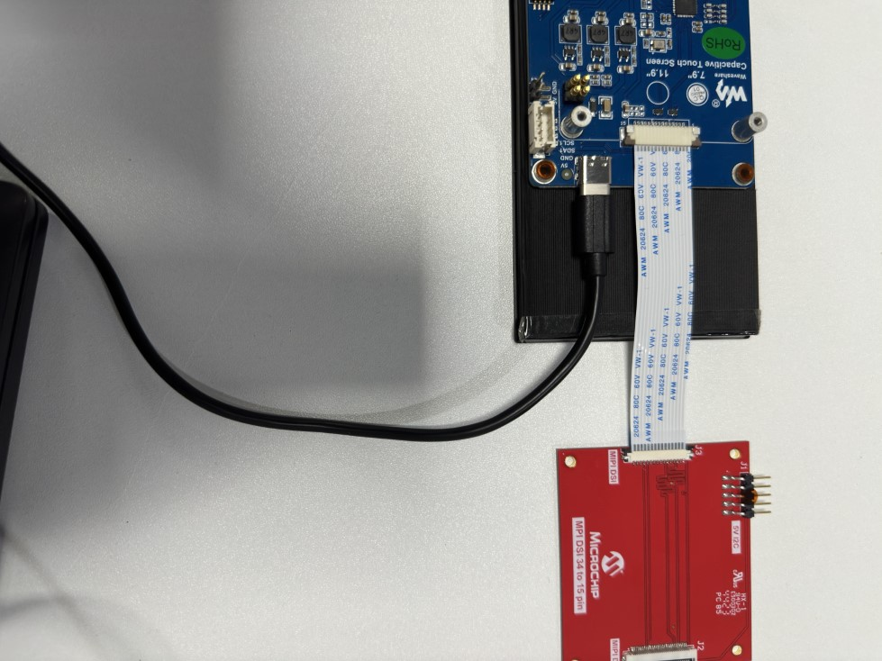
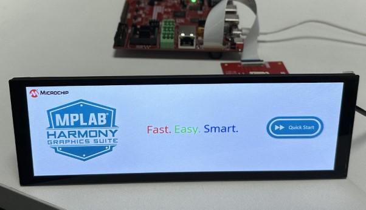

legato_qs_a7d65_curiosity_ws_7_9inch.X

Defining the Architecture
-------------------------

This application demonstrates multi-layer 1280x400 graphics using DDR3 memory.

The included display driver enables the display and controls backlight brightness.
User touch input on the display panel is received through the capacitive touch controller, which is polled by the display driver. The display driver reads the touch information over I2C and sends the touch event to the Graphics Library through the Input System Service.

### Demonstration Features

-   Legato Graphics Library
-   Reference application for the SAMA7D65 Curiosity Board
-   24-bit color, multi-layer, 400x1280 screen design
-   Time system service, RTT peripheral library and driver
-   Graphics Acceleration using integrated display controller (XLCDC)
-   Waveshare 7.9inch DSI LCD driver

Creating the Project Graph
--------------------------
The Project Graph shows the MCC Harmony 3 components that are included in this application. Lines between components are drawn to satisfy components that depend on a capability that another component provides. The display components must be added in order, from left to right, for the display parameters to propogate correctly to the LE XLCDC driver.

The DSI cable I2C FLEXCOM0_IOx pins **PC7** and **PC6** are multiplexed using the Pin Configuration plugin and the XLCDC pixel clock is manually set to **50MHz** in the **LE XLCDC Driver** MCC component.

> **NOTE:** This display has a resolution of 400(W)x1280(H), so it is required to rotate the framebuffer by 90 or 270 degrees to acheive landscape display orientation. This application sets it to 270 degrees for easy access to the ports and the ability to prop the display up using the provided standoffs.

In Microchip Graphics Composer, the resolution is set to 1280(W)x400(H).

Also, the software render orientation is set to 270 degrees.

In the MCC display driver component, the touch orientation is set to 270 degrees.

Building the Application
------------------------

The parent directory for this application is gfx/apps/legato\_quickstart. To build this application, use MPLAB X IDE to open the gfx/apps/legato\_quickstart/firmware/legato\_qs\_a7d65\_curiosity\_ws\_7\_9inch.X project folder and press F11.
A successful build will generate a harmony.bin file in dist/le_qs_a7d65_curiosity_ws_7_9inch/production in the project folder.

The following table lists configuration properties:

|Project Name|BSP Used|Description|
|:-----------|:-------|:----------|
|legato\_qs\_a7d65\_curiosity\_ws\_7\_9inch.X|NA|[SAMA7D65 Curiosity](https://www.microchipdirect.com/dev-tools/EV40F82A?allDevTools=true) and [Waveshare 7.9inch DSI LCD](https://www.waveshare.com/7.9inch-dsi-lcd.htm) Display|

> **NOTE:** This application may contain custom code that is marked by the comments // START OF CUSTOM CODE ... and // END OF CUSTOM CODE. When using the MPLAB Code Configurator to regenerate the application code, do not remove or replace the custom code.

Configuring the Hardware
------------------------

Configure the hardware as follows:
-   Connect a Type C USB cable to power the Waveshare 7.9inch DSI LCD.

- Connect the SAMA7D65 Curiosity board to the MIPI DSI 32pin to 15pin adapter board using the 34 pin Type D FFC ribbon as shown below.

-   Connect the display to the MIPI DSI 32pin to 15pin adapter board using the supplied 15 pin Type A FFC ribbon as shown below.

-	Take an SD Card formatted with the FAT32 file system and copy the boot.bin binary file from this [location](./binaries/boot.bin). Also copy the harmony.bin file you generated from the "Building the Application" section.

-   Insert the SD card into the SD CARD slot on the SAMA7D65 Curiosity and power up the board by connecting a Type-C USB cable to the USB port or an adapter to the barrel jack (5V/1A recommended, Center Positive).

Running the Demonstration
-------------------------
The LCD should display a simple screen with images, text, and a button on successful power-on.

See reference image below.

* * * * *
